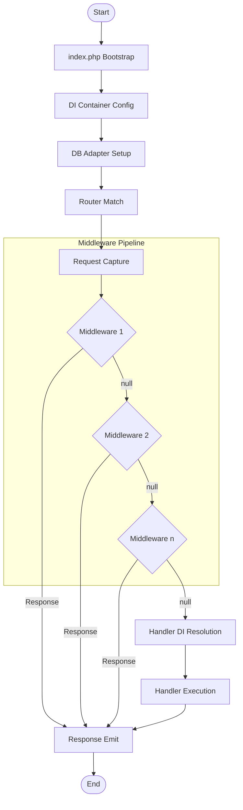

# Mathematical Analysis Report: Flow Modeling (DAG) and CQS Constraints in Parina Framework

This report presents the mathematical formalization of the HTTP request lifecycle and data persistence in the **Parina Framework**, utilizing graph theory and set theory.

---

## 1. Research Hypotheses

### Hypothesis 1: HTTP Flow as a Directed Acyclic Graph (DAG)
The processing flow of an HTTP request in the Parina Framework, from the bootstrapping of the Front Controller (`index.php`) to the emission of the response, is formally representable as a **Directed Acyclic Graph (DAG)**. Interception mechanisms (middlewares) do not create return loops to the source, but rather forward-directed branches that reduce the diameter of the execution flow graph in a controlled manner.

### Hypothesis 2: CQS Segregation via Set Theory
The implementation of the CQS (Command Query Segregation) pattern on the service and repository layers imposes a strict, disjoint mathematical partition on the universe of system operations ($O = Q \cup C$ with $Q \cap C = \emptyset$), forcing queries ($Q$) to act as functions with zero side effects on the logical state of data storage ($S_{db}$).

---

## 2. Development and Formal Modeling

### A. Graph Theory Modeling (DAG)
We model the processing of an HTTP request as a directed graph $G = (V, E)$.

* **Vertex Set ($V$)**:
  $$V = \{ \text{Start}, \text{Bootstrap}, \text{DI-Init}, \text{DB-Setup}, \text{Router}, \text{Request-Capture} \} \cup M \cup \{ \text{DI-Handler}, \text{Handler-Exec}, \text{Response-Emit}, \text{End} \}$$
  where $M = \{m_1, m_2, \dots, m_k\}$ is the ordered sequence of middlewares for the active route.

* **Directed Edge Set ($E$)**:
  Flow transitions and conditional branches in middlewares are defined as:
  * For each middleware $m_i$ ($1 \le i < k$):
    * Linear approval edge: $e_{next} = (m_i, m_{i+1})$ when $m_i(r) = (r', \emptyset)$.
    * Short-circuit edge: $e_{abort} = (m_i, \text{Response-Emit})$ when $m_i(r) = (\emptyset, s)$.
  * For the last middleware $m_k$:
    * Linear approval edge: $e_{next} = (m_k, \text{DI-Handler})$.
    * Short-circuit edge: $e_{abort} = (m_k, \text{Response-Emit})$.
  * For the Handler and final rendering:
    * Edges: $(\text{DI-Handler}, \text{Handler-Exec}) \to (\text{Handler-Exec}, \text{Response-Emit}) \to (\text{Response-Emit}, \text{End})$.

#### Verification of Acyclicity (DAG)
Since the synchronous execution engine of PHP processes the linear sequence of middlewares chronologically forward, and all alternative exit branches point to subsequent nodes (`Response-Emit` or `End`), there are no return edges from a node $v_b \to v_a$ where $b > a$. Therefore, the set of directed cycles is empty ($\mathcal{C} = \emptyset$). It is proven that $G$ is a **Directed Acyclic Graph (DAG)**.

---

### B. Set Theory Modeling (CQS)
Let $S_{db}$ be the set of all possible database states and $R$ be the set of requests. An operation $o \in O$ is defined as:
$$o: R \times S_{db} \to X \times S_{db}$$

We impose the CQS partition on the universe of operations $O$:
$$O = Q \cup C \quad \text{where} \quad Q \cap C = \emptyset$$

#### 1. Properties of the Query Set ($Q$):
For any $q \in Q$:
$$q(r, s_{db}) = (x, s_{db}') \quad \text{where } x \in X_q, s_{db}' \in S_{db}$$
* **No-Mutation Constraint**:
  $$\forall q \in Q, \quad s_{db}' = s_{db}$$
* **Idempotency**:
  $$q(r, q(r, s_{db})) \equiv q(r, s_{db}$$
* **Required Return**:
  $$X_q \neq \{ \emptyset \} \quad \text{and} \quad X_q \neq \{ \text{void} \}$$

#### 2. Properties of the Command Set ($C$):
For any $c \in C$:
$$c(r, s_{db}) = (x, s_{db}') \quad \text{where } x \in X_c, s_{db}' \in S_{db}$$
* **Allowed Mutation**:
  $$\exists c \in C \quad \text{such that} \quad s_{db}' \neq s_{db}$$
* **Return Constraint**:
  $$X_c = \{ \text{void}, \emptyset \} \cup \{ \text{true}, \text{false} \}$$

---

## 3. Modeling of Additional Infrastructure Components

### A. Dependency Injection (DI) as a Dependency Graph
The dependency container (`Container`) can be modeled as a directed dependency graph $G_{di} = (V_{di}, E_{di})$.

* **Vertices ($V_{di}$)**: The set of classes and interfaces registered in the container.
* **Edges ($E_{di}$)**: An edge $(A, B) \in E_{di}$ exists if and only if class $A$ requires $B$ in its constructor to be instantiated.
* **Acyclicity Constraint (DIP)**:
  The DI dependency graph **must be a DAG**:
  $$\mathcal{C}_{di} = \emptyset$$
  If a cycle exists (e.g., $A \to B \to A$), recursive resolution by reflection will fail, causing a stack overflow. The `resolveDependencies()` method acts as a depth-first search (DFS) that linearizes and installs the graph.

---

### B. Authorization System (ACL) as a Composition of Relations
Role and permission-based access control is modeled through three disjoint sets and mapping relations:

* Let $U$ be the set of users, $R$ the set of roles, and $P$ the set of permissions.
* We define the user-to-role assignment relation: $UR \subseteq U \times R$.
* We define the role-to-permission assignment relation: $RP \subseteq R \times P$.

The user's **effective access** relation ($UP$) is obtained through the composition of relations:
$$UP = UR \circ RP \subseteq U \times P$$
$$(u, p) \in UP \iff \exists r \in R \quad \text{such that} \quad (u, r) \in UR \land (r, p) \in RP$$

The middleware's authorization indicator function is:
$$\mathbb{I}_{UP}(u, p) = \begin{cases} 1 & \text{if } (u, p) \in UP \\ 0 & \text{if } (u, p) \notin UP \end{cases}$$

---

### C. Routing (Router) as a Prefix Automaton (Trie)
Route matching in the `Router` can scale from an $O(N)$ linear search to a prefix tree (**Trie**) hierarchical search:

* Let $T$ be a tree where each node represents a segment of the URI.
* Finding the matching route for a given URI of segment length $L$ is done in $O(L)$ time, independent of the total number of registered routes $N$.

---

### D. Rate Limiter (RateLimit) as a Token Bucket
The traffic control middleware is defined under the mathematical model of the **Token Bucket** algorithm:

* Let $B_{max}$ be the bucket capacity, $r$ the regeneration rate of requests per second, and $B(t)$ the free tokens at time $t$.
* The token update equation on each hit is:
  $$B(t) = \min\big(B_{max}, \ B(t_0) + r \cdot (t - t_0)\big)$$
* To allow the request to proceed, we evaluate:
  $$\text{Request State} = \begin{cases} \text{Allowed (Status 200)} & \text{if } B(t) \ge 1 \implies B(t') = B(t) - 1 \\ \text{Rejected (Status 429)} & \text{if } B(t) < 1 \end{cases}$$

---

## 4. Analysis Conclusions

1. **Topological Stability and Determinism**:
   The HTTP flow of the framework behaves as a DAG, guaranteeing that request execution is always **linearizable, predictable, and free of infinite loops** of internal processing.
2. **Mitigation of Server Overload (Short-Circuit)**:
   Graph branching immediately redirects control to the output point (`Response-Emit`) in case of security filter or access policy violations, drastically lowering CPU cost and preventing the DI Container from performing recursive resolution for malicious requests.
3. **Invariance and Security Guaranteed by CQS**:
   Interface segregation in the repository (`UserQueryRepositoryInterface` and `UserCommandRepositoryInterface`) ensures that components injecting queries ($OP_{query} \subset Q$) have **zero side effects** on the physical database state ($S_{db}$). This mathematically certifies the stateless nature of the authentication pipeline.
4. **Dependency Graph Acyclicity (DI)**:
   Modeling dependency injection as a DAG guarantees the stability of object initialization in the system. The call tree can be statically audited in production to prevent infinite instantiation loops.
5. **Mathematical Precision in Security (ACL & RateLimit)**:
   Using binary relation composition for ACL and the continuous Token Bucket algorithm for Rate Limit provides a strict formal basis that eliminates authorization anomalies or imprecise time drift.
6. **Pure and Decoupled Testability**:
   The disjoint separation of CQS operations allows read behaviors to be isolated in fast in-memory mocks, reducing testing environment complexity and ensuring unit tests that are fast and independent of the physical SQL engine.
