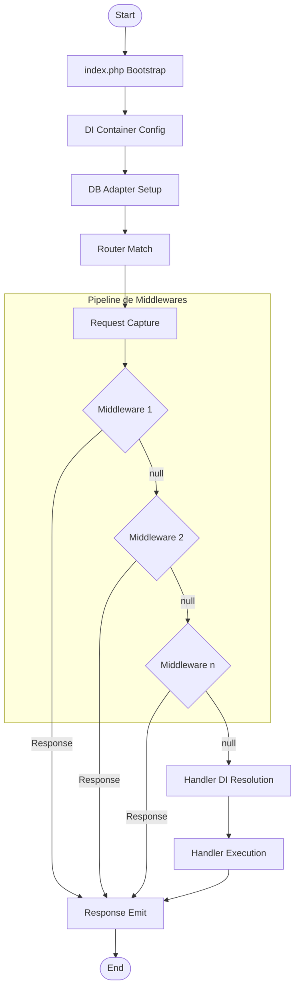

# Reporte de Análisis Matemático: Modelado de Flujo (DAG) y Restricciones CQS en Parina Framework

Este informe presenta la formalización matemática del ciclo de vida de las peticiones HTTP y la persistencia de datos en **Parina Framework**, utilizando teoría de grafos y teoría de conjuntos.

---

## 1. Hipótesis de Investigación

### Hipótesis 1: El Flujo HTTP como un Grafo Dirigido Acíclico (DAG)
El flujo de procesamiento de una petición HTTP en Parina Framework, desde el arranque del Front Controller (`index.php`) hasta la emisión de la respuesta, es representable formalmente como un **Grafo Dirigido Acíclico (DAG)**. Los mecanismos de interceptación (middlewares) no crean bucles de retorno al origen, sino bifurcaciones dirigidas hacia adelante que reducen el diámetro del grafo del flujo de ejecución de manera controlada.

### Hipótesis 2: Segregación CQS mediante Teoría de Conjuntos
La implementación del patrón CQS (Command Query Segregation) sobre la capa de servicios y repositorios impone una partición matemática estricta y disjunta sobre el conjunto de operaciones del sistema ($O = Q \cup C$ con $Q \cap C = \emptyset$), forzando a que las consultas ($Q$) operen como funciones con efectos secundarios nulos sobre el estado lógico del almacenamiento de datos ($S_{db}$).

---

## 2. Desarrollo y Modelado Formal

### A. Modelado de Teoría de Grafos (DAG)
Modelamos el procesamiento de una petición HTTP como un grafo dirigido $G = (V, E)$.

* **Conjunto de Vértices ($V$)**:
  $$V = \{ \text{Start}, \text{Bootstrap}, \text{DI-Init}, \text{DB-Setup}, \text{Router}, \text{Request-Capture} \} \cup M \cup \{ \text{DI-Handler}, \text{Handler-Exec}, \text{Response-Emit}, \text{End} \}$$
  donde $M = \{m_1, m_2, \dots, m_k\}$ es la secuencia ordenada de middlewares para la ruta en ejecución.

* **Conjunto de Arcos Dirigidos ($E$)**:
  Las transiciones de flujo y bifurcaciones condicionales en los middlewares se definen como:
  * Para cada middleware $m_i$ ($1 \le i < k$):
    * Arco de aprobación lineal: $e_{next} = (m_i, m_{i+1})$ cuando $m_i(r) = (r', \emptyset)$.
    * Arco de cortocircuito: $e_{abort} = (m_i, \text{Response-Emit})$ cuando $m_i(r) = (\emptyset, s)$.
  * Para el último middleware $m_k$:
    * Arco de aprobación lineal: $e_{next} = (m_k, \text{DI-Handler})$.
    * Arco de cortocircuito: $e_{abort} = (m_k, \text{Response-Emit})$.
  * Para el Handler y renderización final:
    * Arcos: $(\text{DI-Handler}, \text{Handler-Exec}) \to (\text{Handler-Exec}, \text{Response-Emit}) \to (\text{Response-Emit}, \text{End})$.

#### Verificación de la Aciclicidad (DAG)
Dado que el motor de ejecución síncrono de PHP procesa la secuencia lineal de middlewares cronológicamente hacia adelante, y todas las bifurcaciones alternativas de salida apunten a nodos posteriores (`Response-Emit` o `End`), no existen arcos de retorno de un nodo $v_b \to v_a$ donde $b > a$. Por tanto, el conjunto de ciclos dirigidos es vacío ($\mathcal{C} = \emptyset$). Queda demostrado que $G$ es un **Grafo Dirigido Acíclico (DAG)**.

---

### B. Modelado de Teoría de Conjuntos (CQS)
Sea $S_{db}$ el conjunto de todos los posibles estados de la base de datos y $R$ el de las peticiones. Una operación $o \in O$ se define como:
$$o: R \times S_{db} \to X \times S_{db}$$

Imponemos la partición CQS en el universo de operaciones $O$:
$$O = Q \cup C \quad \text{donde} \quad Q \cap C = \emptyset$$

#### 1. Propiedades del conjunto de Consultas (Queries, $Q$):
Para cualquier $q \in Q$:
$$q(r, s_{db}) = (x, s_{db}') \quad \text{donde } x \in X_q, s_{db}' \in S_{db}$$
* **Restricción de No-Mutación**:
  $$\forall q \in Q, \quad s_{db}' = s_{db}$$
* **Idempotencia**:
  $$q(r, q(r, s_{db})) \equiv q(r, s_{db})$$
* **Retorno Requerido**:
  $$X_q \neq \{ \emptyset \} \quad \text{y} \quad X_q \neq \{ \text{void} \}$$

#### 2. Propiedades del conjunto de Comandos (Commands, $C$):
Para cualquier $c \in C$:
$$c(r, s_{db}) = (x, s_{db}') \quad \text{donde } x \in X_c, s_{db}' \in S_{db}$$
* **Mutación Permitida**:
  $$\exists c \in C \quad \text{tal que} \quad s_{db}' \neq s_{db}$$
* **Restricción de Retorno**:
  $$X_c = \{ \text{void}, \emptyset \} \cup \{ \text{true}, \text{false} \}$$

---

## 3. Conclusiones del Análisis

1. **Estabilidad Topológica y Determinismo**:
   El flujo HTTP del framework se comporta como un DAG, lo que garantiza que la ejecución de la petición sea siempre **linealizable, predecible y libre de bucles infinitos** de procesamiento interno.
2. **Mitigación de Sobrecarga de Servidor (Short-Circuit)**:
   Las bifurcaciones del grafo redirigen de inmediato el control al punto de salida (`Response-Emit`) en caso de violación de políticas de acceso o filtros de seguridad, disminuyendo drásticamente el coste de CPU y evitando la resolución recursiva del Contenedor DI para peticiones maliciosas.
3. **Invariancia y Seguridad Garantizada por CQS**:
   La segregación de interfaces en el repositorio (`UserQueryRepositoryInterface` y `UserCommandRepositoryInterface`) asegura que los componentes que inyectan consultas ($OP_{query} \subset Q$) tengan **cero efectos secundarios** sobre el estado físico de la base de datos ($S_{db}$). Esto certifica matemáticamente la naturaleza stateless del pipeline de autenticación.
4. **Testeabilidad Pura y Desacoplada**:
   La separación disjunta de operaciones de CQS permite aislar los comportamientos de lectura en mocks rápidos en memoria, reduciendo la complejidad del entorno de testing y asegurando pruebas unitarias veloces e independientes del motor SQL físico.
